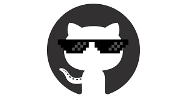

# evertonhubnerdasilva22

  ☀️ Bom dia, boa tarde ou boa noite!

  🎓 Em formação — <em> Formando em Técnico de Informática</em>

 

<h3 align="center">💻 Tecnologias que eu uso</h3>

  
  
  
  
  

 

 

